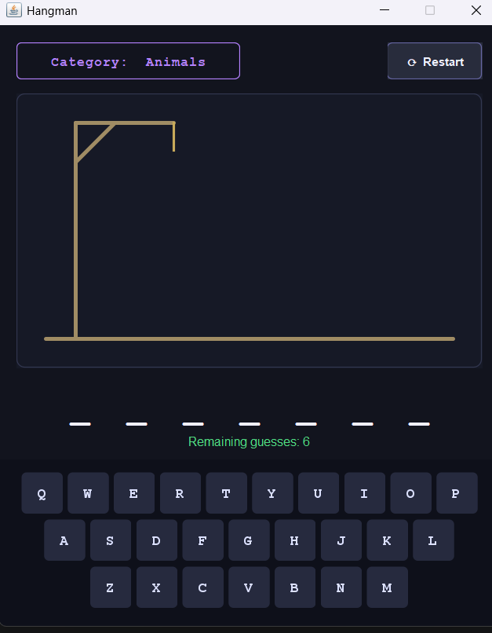
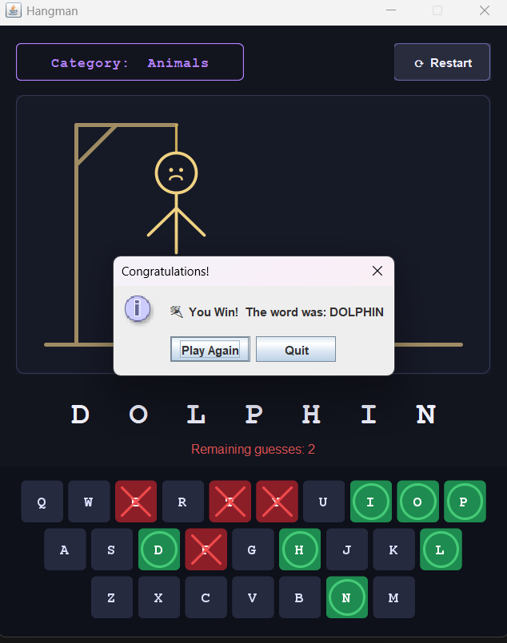
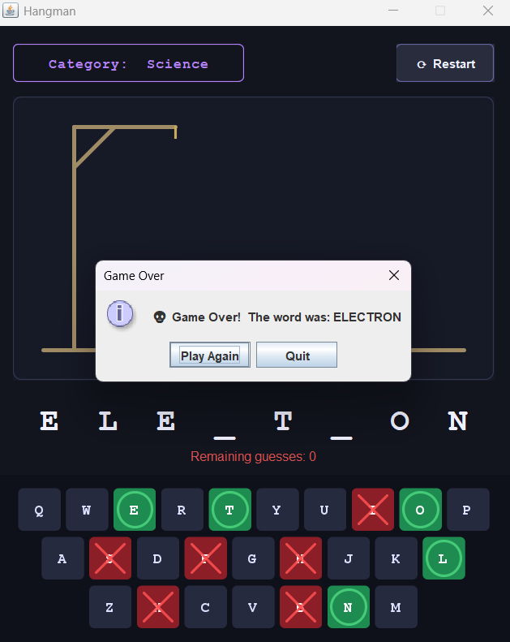
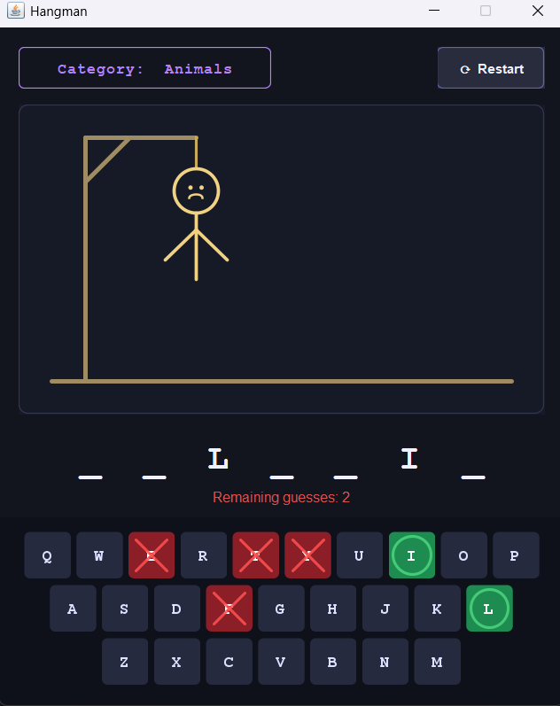

# Java Hangman Game

An interactive GUI-based Hangman game developed using Java Swing.

## Features
- Graphical user interface
- Physical keyboard support
- Animated gameplay
- Multiple word categories
- Restart functionality

## Technologies Used
- Java
- Java Swing
- AWT
- OOP Concepts

## How to Run
1. Compile the Java file
2. Run HangmanGame.java

## Screenshots

### Start Screen

### Winning Screen

### Losing Screen

### Keyboard Interaction

## Author
Jashandeep Kaur
